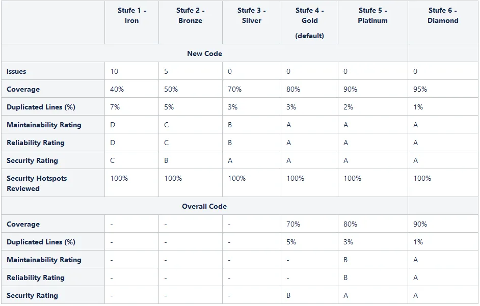

# Code Reviews

Qualitätssicherung und Zusammenarbeit im Entwicklungsteam

  <a href="https://github.com/philippcou/code-review-presentation" target="_blank" class="slidev-icon-btn">
    <carbon:logo-github />
  </a>

---
transition: slide-up
---
<Toc />

---
transition: slide-up
---
# Was ist ein Code Review?

- Strukturierte Überprüfung von Code durch andere Entwickler
- Möglichkeit zu lernen & Wissen zu vertiefen
- Checklist
  - Macht der Code, was er soll?
  - Ist der Code verständlich & gut dokumentiert?
  - Passt der Code zum Team-Standard?
  - Sind Klassen, Methoden, Variablen etc. sinnvoll benannt?
  - Förderung des Teamzusammenhalts (Geteilte 

<!--
Verantwortung)
-->

---
transition: slide-up
---

# Code Review Best Practices

- Regelmäßige Reviews
- Konstruktives Feedback
- Subjektives Feedback als solches deklarieren
- Einsatz von automatisierten Tools

<!--
Üblicherweise bei jedem PR

Feedback positiv gestalten, verbesserungsvorschläge mitgeben

Subjektives Feedback "Nitpicks" als solche definieren

Einsatz von automatisierten tools als vorarbeit
-->

---
transition: slide-up
---

# Pull Request Best Practices

- Branch Name
- Commit Messages
- PRs möglichst klein halten
- Standatisierte Formatierung !!!!!!!!
- Sinnvolle Description im PR
  - Zusammenfassung der Changes
  - Grund des PRs

<!--
Branch Name und Commit Messages mit einem Ticket verlinkt, oder sehr aussagekräftiger Titel

Description vom Pull Request
-->

---
transition: slide-left
---

# Automatisierte Tools

- Verwendung
  - Sicherheitslücken
  - Code Qualität
  - Testabdeckung
- Einsatz im BRZ: Quality Gates

<!--
Vorteile: Erzeugen ein Minimum an Code Qualität, Entlastung der Entwickler, Kleinigkeiten werden of abgefangen, die häufigsten Sicherheitslücken werden erkannt
Nachteile: Verlängerung des Build Prozesses, Entwickler können sich genervt fühlen 
-->

---
transition: slide-left
level: 2
layout: center
---

  

---
transition: slide-up
---

# Sonarqube

- Statische Code Analyse  (Programmiersprachen-spezifische Regeln)
- Testabdeckung
- OWASP Checks

---
transition: slide-up
level: 1
---

# Persönliche Erfahrungen

<v-clicks>
 - Entwickler nehmen sich/haben nicht die Zeit
  
 - Kleinigkeiten werden kommentiert, längere reviews werden vermieden
   
 - Gerade als Junior Entwickler lernt man seinen Standpunkt zu argumentieren
   
 - Weitergabe von Coding Patterns
   
  
Wie nehmt ihr Code Reviews in eurem Projekt wahr?

</v-clicks>

<!--
Ausbau von Soft skills, förderung von kommunikation im Team
-->

---
transition: slide-up
layout: center
---

# Hilfreiche Links

https://google.github.io/eng-practices/review/reviewer/standard.html
 
https://google.github.io/eng-practices/review/reviewer/looking-for.html
 
https://docs.github.com/en/pull-requests/collaborating-with-pull-requests/getting-started/helping-others-review-your-changes

---
transition: slide-up
layout: center
---
# Danke für eure Aufmerksamkeit!